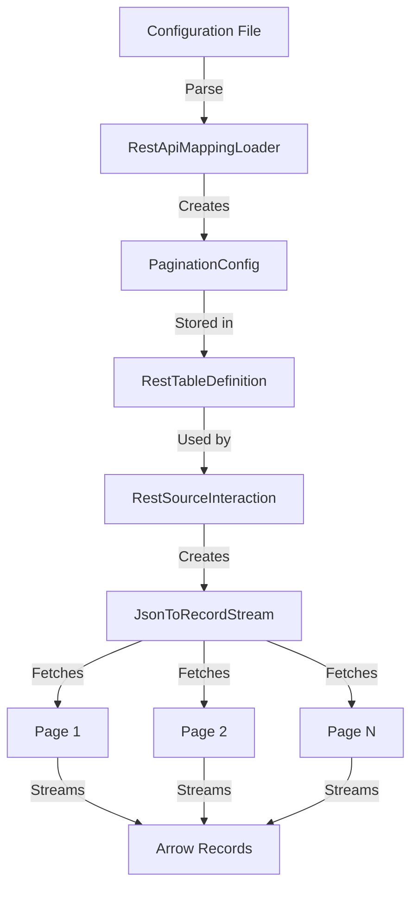

# Pagination Implementation Plan

## Architecture Overview



## Implementation Phases

### Phase 1: Core Classes (Foundation)

**1.1 Create PaginationConfig Class**
- Location: `sdk-gen/subprojects/rest_connector/src/main/java/com/ibm/connect/restconnector/PaginationConfig.java`
- Fields:
  - `type`: String (offset, page, cursor, link_header, next_url)
  - `offsetParam`: String
  - `pageParam`: String
  - `limitParam`: String
  - `pageSize`: int
  - `initialOffset`: int
  - `initialPage`: int
  - `cursorParam`: String
  - `nextCursorPath`: String
  - `nextUrlPath`: String
- Methods:
  - Constructor with all fields
  - Getters for all fields
  - `toString()` for debugging

**1.2 Update RestTableDefinition**
- Add field: `private final PaginationConfig paginationConfig`
- Add constructor parameter
- Add getter: `getPaginationConfig()`
- Update `toString()` to include pagination config

### Phase 2: Configuration Parsing

**2.1 Update RestApiMappingLoader**
- Add method: `private static PaginationConfig parsePaginationConfig(JsonNode tableNode)`
- Parse `$pagination` object from table configuration
- Handle all pagination types
- Validate required fields for each type
- Return null if no pagination configured

**2.2 Integration**
- Call `parsePaginationConfig()` in `parse()` method
- Pass pagination config to `RestTableDefinition` constructor

### Phase 3: JsonToRecordStream Refactoring

**3.1 Add Pagination State Fields**
```java
// Pagination state
private final PaginationConfig paginationConfig;
private int currentOffset;
private int currentPage;
private int recordsInCurrentPage;
private String nextCursor;
private String nextPageUrl;
private int totalPagesFetched;
private static final int MAX_PAGES = 10000; // Safety limit
```

**3.2 Update Constructors**
- Add `PaginationConfig` parameter to all constructors
- Initialize pagination state variables

**3.3 Refactor initialize() Method**
- Build initial URL with pagination parameters
- For offset: add `?offset=0&limit=pageSize`
- For page: add `?page=1&per_page=pageSize`
- For cursor: add `?limit=pageSize` (no cursor on first page)
- For link_header: add `?per_page=pageSize`
- For next_url: add `?limit=pageSize` if configured

**3.4 Implement Page Fetching Logic**

```java
private Record advance() throws IOException {
    // Try to read next object from current page
    if (jsonParser != null && !done) {
        JsonToken token = jsonParser.nextToken();
        
        if (token == JsonToken.START_OBJECT) {
            recordsInCurrentPage++;
            return readCurrentObject();
        }
        
        if (token == JsonToken.END_ARRAY) {
            // Current page exhausted
            if (paginationConfig != null) {
                // Extract pagination metadata before closing
                extractPaginationMetadata();
                
                // Check if more pages exist
                if (hasMorePages()) {
                    fetchNextPage();
                    return advance(); // Recursive call
                }
            }
            done = true;
            return null;
        }
    }
    
    done = true;
    return null;
}
```

**3.5 Implement extractPaginationMetadata()**
```java
private void extractPaginationMetadata() throws IOException {
    if (paginationConfig == null) {
        return;
    }
    
    String type = paginationConfig.getType();
    
    if ("cursor".equals(type) || "next_url".equals(type)) {
        // Continue parsing to find pagination metadata
        String pathToFind = "cursor".equals(type) 
            ? paginationConfig.getNextCursorPath() 
            : paginationConfig.getNextUrlPath();
        
        // Parse remaining JSON to find the path
        String value = findJsonPath(jsonParser, pathToFind);
        
        if ("cursor".equals(type)) {
            nextCursor = value;
        } else {
            nextPageUrl = value;
        }
    }
    // For offset/page types, no metadata needed from response
    // For link_header, metadata is in HTTP headers (already extracted)
}
```

**3.6 Implement hasMorePages()**
```java
private boolean hasMorePages() {
    if (paginationConfig == null) {
        return false;
    }
    
    // Safety check: prevent infinite loops
    if (totalPagesFetched >= MAX_PAGES) {
        LOGGER.warn("Reached maximum page limit of {}, stopping pagination", MAX_PAGES);
        return false;
    }
    
    String type = paginationConfig.getType();
    
    if ("offset".equals(type) || "page".equals(type)) {
        // More pages if current page was full
        return recordsInCurrentPage >= paginationConfig.getPageSize();
    }
    
    if ("cursor".equals(type)) {
        // More pages if we have a next cursor
        return nextCursor != null && !nextCursor.isEmpty();
    }
    
    if ("link_header".equals(type)) {
        // More pages if we have a next URL from Link header
        return nextPageUrl != null && !nextPageUrl.isEmpty();
    }
    
    if ("next_url".equals(type)) {
        // More pages if we have a next URL from response
        return nextPageUrl != null && !nextPageUrl.isEmpty();
    }
    
    return false;
}
```

**3.7 Implement fetchNextPage()**
```java
private void fetchNextPage() throws IOException, InterruptedException {
    // Close current stream
    if (jsonParser != null) {
        jsonParser.close();
    }
    if (responseStream != null) {
        responseStream.close();
    }
    
    // Build next page URL
    String nextUrl = buildNextPageUrl();
    LOGGER.info("Fetching next page: {}", nextUrl);
    
    // Reset page state
    recordsInCurrentPage = 0;
    totalPagesFetched++;
    
    // Open new HTTP connection
    HttpRequest.Builder requestBuilder = HttpRequest.newBuilder()
            .uri(URI.create(nextUrl))
            .timeout(Duration.ofSeconds(HTTP_TIMEOUT_SECONDS))
            .header("Accept", "application/json");
    
    // Add authentication headers
    if (authHeaders != null && !authHeaders.isEmpty()) {
        for (Map.Entry<String, String> header : authHeaders.entrySet()) {
            requestBuilder.header(header.getKey(), header.getValue());
        }
    }
    
    HttpRequest request = requestBuilder.GET().build();
    HttpResponse<InputStream> response = httpClient.send(request, BodyHandlers.ofInputStream());
    
    if (response.statusCode() != HTTP_OK) {
        throw new IOException("HTTP request failed with status " + response.statusCode() + " for URL: " + nextUrl);
    }
    
    // Extract Link header if needed
    if ("link_header".equals(paginationConfig.getType())) {
        nextPageUrl = extractLinkHeader(response.headers());
    }
    
    // Initialize parser for new page
    responseStream = response.body();
    JsonFactory factory = new JsonFactory();
    jsonParser = factory.createParser(responseStream);
    
    // Navigate to data array
    JsonToken firstToken = jsonParser.nextToken();
    if (dataPath != null && !dataPath.isEmpty()) {
        navigateToDataPath();
    } else if (firstToken != JsonToken.START_ARRAY) {
        throw new IOException("Expected START_ARRAY but got: " + firstToken);
    }
}
```

**3.8 Implement buildNextPageUrl()**
```java
private String buildNextPageUrl() {
    String type = paginationConfig.getType();
    
    if ("offset".equals(type)) {
        currentOffset += paginationConfig.getPageSize();
        return buildUrlWithParams(
            paginationConfig.getOffsetParam(), String.valueOf(currentOffset),
            paginationConfig.getLimitParam(), String.valueOf(paginationConfig.getPageSize())
        );
    }
    
    if ("page".equals(type)) {
        currentPage++;
        return buildUrlWithParams(
            paginationConfig.getPageParam(), String.valueOf(currentPage),
            paginationConfig.getLimitParam(), String.valueOf(paginationConfig.getPageSize())
        );
    }
    
    if ("cursor".equals(type)) {
        return buildUrlWithParams(
            paginationConfig.getCursorParam(), nextCursor,
            paginationConfig.getLimitParam(), String.valueOf(paginationConfig.getPageSize())
        );
    }
    
    if ("link_header".equals(type) || "next_url".equals(type)) {
        return nextPageUrl;
    }
    
    throw new IllegalStateException("Unknown pagination type: " + type);
}

private String buildUrlWithParams(String param1, String value1, String param2, String value2) {
    StringBuilder sb = new StringBuilder(url);
    
    // Check if URL already has query params
    boolean hasParams = url.contains("?");
    
    sb.append(hasParams ? "&" : "?");
    sb.append(param1).append("=").append(value1);
    
    if (param2 != null && value2 != null) {
        sb.append("&").append(param2).append("=").append(value2);
    }
    
    return sb.toString();
}
```

**3.9 Implement Helper Methods**
```java
private String extractLinkHeader(HttpHeaders headers) {
    Optional<String> linkHeader = headers.firstValue("Link");
    if (!linkHeader.isPresent()) {
        return null;
    }
    
    // Parse Link header: <url>; rel="next"
    String[] links = linkHeader.get().split(",");
    for (String link : links) {
        if (link.contains("rel=\"next\"") || link.contains("rel='next'")) {
            int start = link.indexOf('<') + 1;
            int end = link.indexOf('>');
            if (start > 0 && end > start) {
                return link.substring(start, end);
            }
        }
    }
    return null;
}

private String findJsonPath(JsonParser parser, String path) throws IOException {
    // Simple implementation for paths like "pagination.next" or "meta.next_token"
    String[] parts = path.split("\\.");
    
    // Continue parsing from current position
    while (parser.nextToken() != null) {
        if (parser.getCurrentToken() == JsonToken.FIELD_NAME) {
            String fieldName = parser.currentName();
            
            // Check if this matches first part of path
            if (fieldName.equals(parts[0])) {
                if (parts.length == 1) {
                    // Found it, return value
                    parser.nextToken();
                    return parser.getValueAsString();
                } else {
                    // Need to go deeper
                    parser.nextToken(); // Move to value
                    if (parser.getCurrentToken() == JsonToken.START_OBJECT) {
                        // Recursively search in nested object
                        String nestedPath = String.join(".", Arrays.copyOfRange(parts, 1, parts.length));
                        return findJsonPath(parser, nestedPath);
                    }
                }
            }
        }
    }
    return null;
}
```

### Phase 4: Integration and Testing

**4.1 Update RestSourceInteraction**
- Pass `tableDef.getPaginationConfig()` to `JsonToRecordStream` constructor

**4.2 Create Test Configurations**
- Create test configs for each pagination type
- Use real API examples where possible

**4.3 Testing**
- Unit tests for PaginationConfig parsing
- Unit tests for URL building
- Integration tests with mock APIs
- Manual tests with real APIs

## Implementation Checklist

- [ ] Create PaginationConfig class
- [ ] Update RestTableDefinition with pagination field
- [ ] Update RestApiMappingLoader to parse $pagination
- [ ] Add pagination state fields to JsonToRecordStream
- [ ] Update JsonToRecordStream constructors
- [ ] Refactor initialize() to add pagination params
- [ ] Implement advance() with page fetching
- [ ] Implement extractPaginationMetadata()
- [ ] Implement hasMorePages()
- [ ] Implement fetchNextPage()
- [ ] Implement buildNextPageUrl()
- [ ] Implement extractLinkHeader()
- [ ] Implement findJsonPath()
- [ ] Update RestSourceInteraction integration
- [ ] Create test configurations
- [ ] Write unit tests
- [ ] Write integration tests
- [ ] Test with real APIs
- [ ] Update documentation

## Configuration Examples to Create

1. **ServiceNow** (offset-based)
2. **GitHub** (link_header)
3. **Twitter** (cursor-based)
4. **Generic REST API** (page-based)
5. **API with next_url** (next_url type)

## Success Criteria

- [ ] All pagination types work correctly
- [ ] Streaming architecture maintained (one page in memory)
- [ ] Proper termination detection
- [ ] No infinite loops
- [ ] Error handling for HTTP failures
- [ ] Logging for debugging
- [ ] PMD compliant code
- [ ] Documentation complete